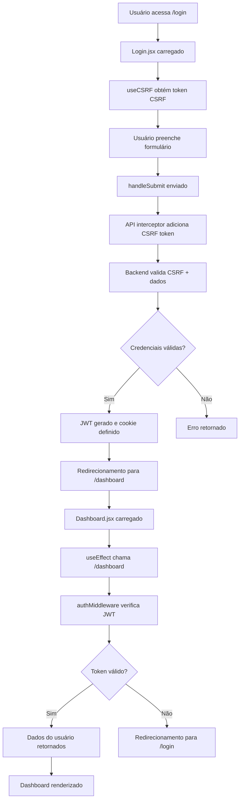

# Análise Completa: Login/Signup → Dashboard

## 📋 Resumo Executivo

Esta análise examina o fluxo completo de autenticação da aplicação TreinAI, desde o login/signup até o acesso ao dashboard, identificando problemas críticos e potenciais melhorias.

## 🔍 Componentes Analisados

### Backend
- `authController.js` - Controlador de autenticação
- `authMiddleware.js` - Middleware de verificação de token
- `csrfMiddleware.js` - Middleware de proteção CSRF
- `validationMiddleware.js` - Validação de dados
- `authRoutes.js` - Rotas de autenticação
- `index.js` - Configurações CORS e cookies

### Frontend
- `Login.jsx` - Componente de login/signup
- `Dashboard.jsx` - Componente principal do dashboard
- `useCSRF.js` - Hook para gerenciamento CSRF
- `Api.js` - Configuração da API

## 🚨 Problemas Críticos Identificados

### 1. **Configuração de URL Incorreta** ⚠️
**Arquivo:** `back/.env`
**Problema:** A `FRONTEND_URL` estava configurada para porta `5173` enquanto o frontend roda na `5174`
**Status:** ✅ **CORRIGIDO**
```env
# Antes
FRONTEND_URL=http://192.168.1.2:5173

# Depois
FRONTEND_URL=http://192.168.1.2:5174
```

### 2. **Configuração CORS Problemática** 🔴
**Arquivo:** `back/index.js`
**Problema:** Em desenvolvimento, permite qualquer origem, mas pode causar problemas de segurança
```javascript
// Problema: Muito permissivo em desenvolvimento
if (process.env.NODE_ENV !== 'production') {
    console.log(`🌐 CORS [DEV]: Permitindo origem: ${origin || 'sem origin'}`);
    return callback(null, true); // Permite QUALQUER origem
}
```

### 3. **Configuração de Cookies Insegura** 🔴
**Arquivo:** `back/controllers/authController.js`
**Problema:** Cookies configurados com `secure: false` e `sameSite: 'none'`
```javascript
res.cookie('authToken', token, {
    httpOnly: true,
    secure: false, // ❌ Inseguro para produção
    sameSite: 'none', // ❌ Permite ataques CSRF
    maxAge: 24 * 60 * 60 * 1000,
    path: '/'
});
```

### 4. **Falta de Validação de Ambiente** 🔴
**Problema:** Configurações de desenvolvimento sendo usadas em produção
**Impacto:** Vulnerabilidades de segurança

### 5. **Gerenciamento de Estado Inconsistente** 🟡
**Arquivo:** `front/src/pages/Login.jsx`
**Problema:** Estado `logado` não é gerenciado globalmente
```javascript
// Problema: setLogado não está definido no contexto
if (res.data.token) {
    navigate('/dashboard');
    setLogado(true); // ❌ setLogado não definido
}
```

## 🔧 Problemas Menores

### 1. **Logs Excessivos** 🟡
**Arquivo:** `back/index.js`
**Problema:** Muitos logs de CORS em produção podem impactar performance

### 2. **Timeout da API** 🟡
**Arquivo:** `front/src/Api.js`
**Problema:** Timeout de 10 segundos pode ser insuficiente para operações lentas

### 3. **Tratamento de Erro Genérico** 🟡
**Arquivo:** `front/src/pages/Login.jsx`
**Problema:** Mensagens de erro muito genéricas para o usuário

## ✅ Pontos Positivos Identificados

### 1. **Arquitetura de Segurança Robusta**
- ✅ Tokens CSRF implementados corretamente
- ✅ Cookies httpOnly para JWT
- ✅ Middleware de validação com Joi
- ✅ Rate limiting implementado
- ✅ Headers de segurança configurados

### 2. **Estrutura de Código Organizada**
- ✅ Separação clara entre frontend e backend
- ✅ Middlewares bem estruturados
- ✅ Tratamento centralizado de erros
- ✅ Hooks customizados para funcionalidades específicas

### 3. **Funcionalidades Avançadas**
- ✅ Sistema de onboarding inteligente
- ✅ Gerenciamento de temas
- ✅ Sistema de gamificação
- ✅ Interceptors para renovação automática de tokens

## 🛠️ Recomendações de Correção

### Prioridade Alta 🔴

#### 1. Corrigir Configuração de Cookies
```javascript
// authController.js - Configuração baseada no ambiente
const cookieOptions = {
    httpOnly: true,
    secure: process.env.NODE_ENV === 'production', // true em produção
    sameSite: process.env.NODE_ENV === 'production' ? 'strict' : 'lax',
    maxAge: 24 * 60 * 60 * 1000,
    path: '/'
};
res.cookie('authToken', token, cookieOptions);
```

#### 2. Melhorar Configuração CORS
```javascript
// index.js - CORS mais restritivo em desenvolvimento
const corsOptions = {
    origin: function (origin, callback) {
        const allowedOrigins = [
            process.env.FRONTEND_URL,
            'http://localhost:5173',
            'http://localhost:5174',
            'http://192.168.1.2:5173',
            'http://192.168.1.2:5174'
        ].filter(Boolean);
        
        if (!origin || allowedOrigins.includes(origin)) {
            callback(null, true);
        } else {
            callback(new Error('Não permitido pelo CORS'));
        }
    },
    credentials: true
};
```

#### 3. Implementar Gerenciamento Global de Estado
```javascript
// Criar contexto de autenticação
const AuthContext = createContext();

export const AuthProvider = ({ children }) => {
    const [isAuthenticated, setIsAuthenticated] = useState(false);
    const [user, setUser] = useState(null);
    
    return (
        <AuthContext.Provider value={{ isAuthenticated, setIsAuthenticated, user, setUser }}>
            {children}
        </AuthContext.Provider>
    );
};
```

### Prioridade Média 🟡

#### 1. Melhorar Tratamento de Erros
```javascript
// errorHandler.js - Mensagens mais específicas
export const getErrorMessage = (error) => {
    const errorMessages = {
        'INVALID_CREDENTIALS': 'Email ou senha incorretos',
        'USER_NOT_FOUND': 'Usuário não encontrado',
        'CSRF_TOKEN_INVALID': 'Sessão expirada, faça login novamente',
        'NETWORK_ERROR': 'Erro de conexão. Verifique sua internet'
    };
    
    return errorMessages[error.code] || 'Erro interno do servidor';
};
```

#### 2. Implementar Retry Logic
```javascript
// Api.js - Retry automático para falhas de rede
const retryRequest = async (config, maxRetries = 3) => {
    for (let i = 0; i < maxRetries; i++) {
        try {
            return await axios(config);
        } catch (error) {
            if (i === maxRetries - 1) throw error;
            await new Promise(resolve => setTimeout(resolve, 1000 * (i + 1)));
        }
    }
};
```

### Prioridade Baixa 🟢

#### 1. Otimizar Logs
```javascript
// logger.js - Sistema de logs estruturado
const logger = {
    info: (message, data) => {
        if (process.env.NODE_ENV !== 'production') {
            console.log(`ℹ️ ${message}`, data);
        }
    },
    error: (message, error) => {
        console.error(`❌ ${message}`, error);
    }
};
```

#### 2. Implementar Health Check
```javascript
// routes/health.js
app.get('/health', (req, res) => {
    res.json({
        status: 'ok',
        timestamp: new Date().toISOString(),
        uptime: process.uptime()
    });
});
```

## 🔄 Fluxo de Autenticação Atual



## 📊 Métricas de Segurança

| Aspecto | Status | Nota |
|---------|--------|------|
| Autenticação JWT | ✅ Implementado | 9/10 |
| Proteção CSRF | ✅ Implementado | 8/10 |
| Cookies Seguros | ⚠️ Parcial | 6/10 |
| CORS Configurado | ⚠️ Parcial | 7/10 |
| Rate Limiting | ✅ Implementado | 8/10 |
| Validação de Dados | ✅ Implementado | 9/10 |
| Headers de Segurança | ✅ Implementado | 8/10 |

## 🎯 Próximos Passos

1. **Imediato:** Corrigir configurações de cookies e CORS
2. **Curto prazo:** Implementar gerenciamento global de estado
3. **Médio prazo:** Melhorar tratamento de erros e logs
4. **Longo prazo:** Implementar testes automatizados de segurança

## 📝 Conclusão

O sistema de autenticação possui uma base sólida com implementações corretas de JWT, CSRF e validações. Os principais problemas identificados são relacionados à configuração de ambiente e segurança de cookies, que podem ser facilmente corrigidos seguindo as recomendações acima.

**Prioridade de correção:**
1. 🔴 Configurações de segurança (cookies, CORS)
2. 🟡 Gerenciamento de estado global
3. 🟢 Otimizações e melhorias de UX

---
*Análise realizada em: ${new Date().toLocaleDateString('pt-BR')}*
*Versão do documento: 1.0*