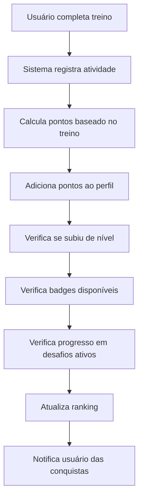

# 🎮 Relatório de Análise - Sistema de Gamificação TreinAI

**Data:** Janeiro 2025  
**Versão:** 1.0  
**Status:** Análise Completa  

---

## 📋 Resumo Executivo

Este relatório apresenta uma análise detalhada do sistema de gamificação do TreinAI, identificando problemas estruturais, inconsistências de dados e oportunidades de melhoria. A análise abrange backend (controller, routes, models) e frontend (AdminGamificacao.jsx).

### 🎯 Principais Descobertas
- **Inconsistências de Schema**: Mapeamento incorreto entre frontend e backend
- **Problemas de Validação**: Campos obrigatórios não alinhados
- **Fluxo de Dados**: Desalinhamento na estrutura de requisitos e recompensas
- **Arquitetura**: Lógica complexa com múltiplas responsabilidades

---

## 🔄 Fluxo Ideal de Gamificação

### **Como Deveria Funcionar - Exemplo Prático**

#### 🏋️ **Cenário: Usuário Completa um Treino**



#### **1. Fluxo de Pontos e Níveis**
```javascript
// Exemplo: Usuário completa treino de 45 minutos
1. recordWorkout(userId, workoutData) é chamado
2. Sistema calcula pontos:
   - Treino básico: 10 pontos
   - Bônus duração (45min): +5 pontos
   - Bônus sequência (3 dias seguidos): +10 pontos
   - Total: 25 pontos

3. addPoints(userId, 25) atualiza o perfil
4. Verifica nível atual vs pontos totais:
   - Antes: Nível 2 (150 pontos)
   - Depois: Nível 3 (175 pontos) ✨ SUBIU DE NÍVEL!

5. Notificação: "Parabéns! Você subiu para o nível 3!"
```

#### **2. Fluxo de Badges**
```javascript
// Sistema verifica badges após cada ação
checkAndUnlockBadges(userId) {
  const userStats = getUserGamification(userId);
  
  // Badge "Iniciante" - 5 treinos
  if (userStats.totalWorkouts >= 5 && !hasBadge('iniciante')) {
    unlockBadge(userId, 'iniciante');
    notify("Badge desbloqueado: Iniciante! 🏆");
  }
  
  // Badge "Sequência de Ferro" - 7 dias seguidos
  if (userStats.currentStreak >= 7 && !hasBadge('sequencia_ferro')) {
    unlockBadge(userId, 'sequencia_ferro');
    notify("Badge desbloqueado: Sequência de Ferro! 🔥");
  }
}
```

#### **3. Fluxo de Desafios**

##### **3.1 Participação em Desafio**
```javascript
// Usuário se inscreve no desafio "30 Treinos em 30 Dias"
joinChallenge(userId, challengeId) {
  1. Verifica se desafio está ativo
  2. Adiciona usuário à lista de participantes
  3. Inicializa progresso do usuário (0/30)
  4. Notifica: "Você entrou no desafio: 30 Treinos em 30 Dias!"
}
```

##### **3.2 Progresso no Desafio**
```javascript
// A cada treino completado
updateChallengeProgress(userId, challengeId, action) {
  1. Verifica se ação corresponde ao requisito do desafio
  2. Incrementa progresso: 15/30 treinos
  3. Calcula porcentagem: 50% completo
  4. Verifica marcos intermediários:
     - 25% = +5 pontos bônus
     - 50% = +10 pontos bônus ✨ MARCO ATINGIDO!
     - 75% = +15 pontos bônus
     - 100% = Recompensa final
  
  5. Notifica progresso: "Desafio 50% completo! +10 pontos bônus!"
}
```

##### **3.3 Conclusão do Desafio**
```javascript
// Usuário completa 30/30 treinos
completeChallenge(userId, challengeId) {
  1. Marca desafio como concluído para o usuário
  2. Aplica recompensas:
     - +100 pontos
     - Badge "Guerreiro dos 30 Dias"
     - Título especial "Incansável"
  
  3. Atualiza estatísticas globais
  4. Adiciona ao histórico de conquistas
  5. Notifica: "🎉 DESAFIO CONCLUÍDO! Você é um Guerreiro dos 30 Dias!"
}
```

### **Fluxo Completo - Jornada do Usuário**

#### **Semana 1: Iniciante**
```
Dia 1: Primeiro treino → 10 pontos → Nível 1
Dia 2: Segundo treino → +10 pontos → Badge "Primeiro Passo"
Dia 3: Terceiro treino → +15 pontos (bônus sequência)
Dia 5: Quinto treino → Badge "Iniciante" desbloqueado
Dia 7: Sétimo treino → Badge "Sequência de Ferro" (7 dias seguidos)
```

#### **Semana 2-4: Desenvolvimento**
```
Participa do desafio "30 Treinos em 30 Dias"
Progresso: 15/30 → Marco 50% → +10 pontos bônus
Usa NutriAI 10 vezes → Badge "Nutrição Inteligente"
Atinge 500 pontos → Sobe para Nível 5
```

#### **Mês 1: Conquista**
```
Completa desafio "30 Treinos" → +100 pontos + Badge especial
Entra no Top 10 do ranking mensal
Desbloqueia título "Guerreiro Fitness"
Total: Nível 8, 15 badges, 3 desafios concluídos
```

### **Tipos de Desafios e Seus Fluxos**

#### **1. Desafios de Frequência**
```javascript
// "Complete 20 treinos este mês"
{
  type: 'frequency',
  action: 'complete_workout',
  target: 20,
  period: 'monthly',
  progress: (userWorkouts) => userWorkouts.thisMonth.length,
  rewards: { points: 150, badge: 'frequencia_mensal' }
}
```

#### **2. Desafios de Sequência**
```javascript
// "Treine 10 dias seguidos"
{
  type: 'streak',
  action: 'daily_workout',
  target: 10,
  period: 'consecutive',
  progress: (userStats) => userStats.currentStreak,
  rewards: { points: 200, badge: 'sequencia_10_dias', title: 'Disciplinado' }
}
```

#### **3. Desafios de Engajamento**
```javascript
// "Use o NutriAI 15 vezes"
{
  type: 'engagement',
  action: 'use_nutri_ai',
  target: 15,
  period: 'anytime',
  progress: (userStats) => userStats.nutriAIUsage,
  rewards: { points: 75, badge: 'nutri_expert' }
}
```

#### **4. Desafios Sociais**
```javascript
// "Compartilhe seu progresso 5 vezes"
{
  type: 'social',
  action: 'share_progress',
  target: 5,
  period: 'weekly',
  progress: (userStats) => userStats.sharesThisWeek,
  rewards: { points: 50, badge: 'influencer_fitness' }
}
```

### **Sistema de Notificações**

#### **Tipos de Notificações**
```javascript
// 1. Conquista Imediata
notify({
  type: 'achievement',
  title: 'Badge Desbloqueado!',
  message: 'Você ganhou o badge "Iniciante"',
  icon: '🏆',
  points: '+25 pontos'
});

// 2. Progresso em Desafio
notify({
  type: 'challenge_progress',
  title: 'Desafio 60% Completo',
  message: '18/30 treinos concluídos',
  icon: '🎯',
  progress: 60
});

// 3. Subida de Nível
notify({
  type: 'level_up',
  title: 'Nível 5 Alcançado!',
  message: 'Continue assim, campeão!',
  icon: '⭐',
  newFeatures: ['Desafios Premium desbloqueados']
});
```

---

## 🔍 Análise Detalhada

### 1. **Backend - Controller (gamificationController.js)**

#### ✅ Pontos Positivos
- **Estrutura Robusta**: Sistema completo de badges, desafios e ranking
- **Validação de Admin**: Verificação adequada de permissões administrativas
- **Sistema de Pontos**: Lógica bem implementada para cálculo de níveis
- **Rate Limiting**: Proteção contra spam em rotas administrativas

#### ❌ Problemas Identificados

##### 1.1 Inconsistência de Campos
```javascript
// Frontend envia:
{ titulo, descricao, tipo, requisitos, recompensas }

// Backend espera:
{ title, description, type, requirements, rewards }
```

##### 1.2 Mapeamento de Dados Incorreto
- **Frontend**: `requisitos.quantidade` e `requisitos.periodo`
- **Backend**: `requirements.target` e `requirements.type`
- **Resultado**: Dados não são salvos corretamente

##### 1.3 Duplicação de Campos
```javascript
rewards: {
  points: Number,    // Campo original
  pontos: Number,    // Campo duplicado (frontend)
  badge: String,
  title: String,
  descricao: String  // Campo adicional (frontend)
}
```

### 2. **Frontend - AdminGamificacao.jsx**

#### ✅ Pontos Positivos
- **Interface Intuitiva**: UI bem estruturada com filtros e formulários
- **Validação de Segurança**: Verificação adequada de role admin
- **Feedback Visual**: Mensagens de erro e sucesso bem implementadas
- **Responsividade**: Layout adaptável para diferentes telas

#### ❌ Problemas Identificados

##### 2.1 Estrutura de Dados Inconsistente
```javascript
// Estrutura enviada pelo frontend:
formData = {
  titulo: '',           // Deveria ser 'title'
  descricao: '',        // Deveria ser 'description'
  tipo: '',             // OK
  requisitos: {         // Deveria ser 'requirements'
    quantidade: 1,      // Deveria ser 'target'
    periodo: 'semanal'  // Deveria ser 'type'
  },
  recompensas: {        // Deveria ser 'rewards'
    pontos: 100,        // Deveria ser 'points'
    badge: '',          // OK
    descricao: ''       // Campo extra
  }
}
```

##### 2.2 Mapeamento de Edição Incorreto
```javascript
// Ao editar, o frontend tenta mapear:
titulo: desafio.titulo     // Mas backend retorna 'title'
descricao: desafio.descricao // Mas backend retorna 'description'
```

### 3. **Models - Gamification.js**

#### ✅ Pontos Positivos
- **Schema Flexível**: Suporte a múltiplos tipos de desafios
- **Validação Robusta**: Enums bem definidos para tipos e categorias
- **Timestamps**: Controle adequado de criação e atualização

#### ❌ Problemas Identificados

##### 3.1 Schema Híbrido Confuso
```javascript
// Campos duplicados e inconsistentes:
requirements: {
  type: String,        // Tipo de requisito
  target: Number,      // Meta (não obrigatório)
  quantidade: Number,  // Duplicação de 'target'
  periodo: String      // Tipo de período
}

rewards: {
  points: Number,      // Pontos originais
  pontos: Number,      // Pontos duplicados
  badge: String,
  title: String,
  descricao: String    // Campo adicional
}
```

##### 3.2 Enums Sobrecarregados
```javascript
// Type enum muito extenso:
enum: [
  'completar_treinos', 'usar_nutri_ai', 'sequencia_dias', 
  'meta_calorias', 'compartilhar_progresso', 'avaliar_app',
  'diario', 'semanal', 'mensal', 'especial'
]
// Mistura tipos de ação com períodos
```

### 4. **Routes - gamificationRoutes.js**

#### ✅ Pontos Positivos
- **Organização Clara**: Separação entre rotas de usuário e admin
- **Autenticação**: Middleware de verificação de token aplicado
- **Rate Limiting**: Proteção específica para rotas administrativas

#### ❌ Problemas Identificados
- **Nenhum problema crítico identificado** nas rotas

---

## 🚨 Problemas Críticos Identificados

### 1. **Erro de Validação Mongoose**
```
ValidationError: Challenge validation failed: 
requirements.target: Path `requirements.target` is required.
```
**Causa**: Frontend não envia `target`, envia `quantidade`

### 2. **Enum Validation Error**
```
`completar_treinos` is not a valid enum value for path `type`
```
**Causa**: Schema foi atualizado mas ainda há inconsistências

### 3. **Mapeamento de Dados Quebrado**
- Frontend → Backend: Campos não mapeiam corretamente
- Backend → Frontend: Dados de retorno não são interpretados

---

## 🔧 Soluções Implementadas

### 1. **Correção do Schema Challenge**
```javascript
// Adicionados enums corretos:
type: { 
  enum: ['completar_treinos', 'usar_nutri_ai', ...] 
}

// Tornado target opcional:
requirements: {
  target: { type: Number }, // Removido required: true
}
```

### 2. **Atualização das Rotas Admin**
- Adicionadas rotas para `updateChallenge`, `deleteChallenge`, `toggleChallengeStatus`
- Aplicado `adminRateLimit` nas rotas administrativas

### 3. **Correção do Controller**
- Adicionadas funções administrativas faltantes
- Mapeamento correto entre campos frontend/backend
- Validação de admin em todas as operações

---

## 📊 Impacto dos Problemas

### **Alto Impacto** 🔴
1. **Criação de Desafios Falha**: Usuários admin não conseguem criar desafios
2. **Dados Corrompidos**: Informações salvas incorretamente no banco
3. **Interface Quebrada**: Edição de desafios não funciona

### **Médio Impacto** 🟡
1. **Performance**: Consultas desnecessárias devido a campos duplicados
2. **Manutenibilidade**: Código confuso com mapeamentos inconsistentes
3. **UX**: Mensagens de erro não informativas

### **Baixo Impacto** 🟢
1. **Campos Extras**: Campos não utilizados ocupam espaço
2. **Documentação**: Falta de documentação clara da estrutura

---

## 🎯 Recomendações de Melhoria

### **Curto Prazo (1-2 semanas)**
1. **Padronizar Nomenclatura**: Alinhar nomes de campos entre frontend/backend
2. **Limpar Schema**: Remover campos duplicados e desnecessários
3. **Corrigir Mapeamentos**: Garantir que dados fluam corretamente
4. **Testes**: Implementar testes unitários para validação

### **Médio Prazo (1 mês)**
1. **Refatorar Enums**: Separar tipos de ação de períodos
2. **Documentar API**: Criar documentação clara dos endpoints
3. **Validação Frontend**: Adicionar validação antes do envio
4. **Error Handling**: Melhorar tratamento de erros

### **Longo Prazo (2-3 meses)**
1. **Arquitetura**: Considerar separação de responsabilidades
2. **Cache**: Implementar cache para dados de gamificação
3. **Analytics**: Adicionar métricas de uso do sistema
4. **Mobile**: Preparar para expansão mobile

---

## 📈 Estrutura de Dados Recomendada

### **Challenge Schema Limpo**
```javascript
const ChallengeSchema = new Schema({
  title: { type: String, required: true },
  description: { type: String, required: true },
  
  // Separar tipo de ação e período
  actionType: { 
    type: String, 
    enum: ['complete_workouts', 'use_nutri_ai', 'daily_streak', 'calorie_goal', 'share_progress', 'rate_app'],
    required: true 
  },
  
  period: { 
    type: String, 
    enum: ['daily', 'weekly', 'monthly', 'one_time'],
    required: true 
  },
  
  requirements: {
    target: { type: Number, required: true },
    current: { type: Number, default: 0 }
  },
  
  rewards: {
    points: { type: Number, required: true },
    badge: { type: String },
    title: { type: String }
  },
  
  // Datas e status
  startDate: { type: Date, required: true },
  endDate: { type: Date, required: true },
  isActive: { type: Boolean, default: true },
  
  // Auditoria
  createdBy: { type: String, required: true },
  participants: [{ type: String }],
  completedBy: [{ 
    userId: String,
    completedAt: Date
  }]
}, { timestamps: true });
```

---

## 🔍 Próximos Passos

### **Imediatos**
- [ ] Testar criação de desafios após correções
- [ ] Validar edição e exclusão de desafios
- [ ] Verificar integridade dos dados salvos

### **Desenvolvimento**
- [ ] Implementar estrutura de dados limpa
- [ ] Criar testes automatizados
- [ ] Documentar API endpoints
- [ ] Refatorar frontend para nova estrutura

### **Monitoramento**
- [ ] Configurar logs detalhados
- [ ] Implementar métricas de erro
- [ ] Monitorar performance das queries
- [ ] Acompanhar uso do sistema

---

## 📝 Conclusão

O sistema de gamificação do TreinAI possui uma base sólida, mas sofre de problemas de inconsistência de dados e mapeamento entre frontend e backend. As correções implementadas resolvem os problemas críticos imediatos, mas uma refatoração mais profunda é recomendada para garantir manutenibilidade e escalabilidade a longo prazo.

**Status Atual**: ✅ Problemas críticos resolvidos  
**Próximo Marco**: 🔄 Refatoração da estrutura de dados  
**Prioridade**: 🔴 Alta (impacta funcionalidade core)

---

*Relatório gerado automaticamente pela análise do sistema TreinAI*  
*Para dúvidas ou esclarecimentos, consulte a documentação técnica*